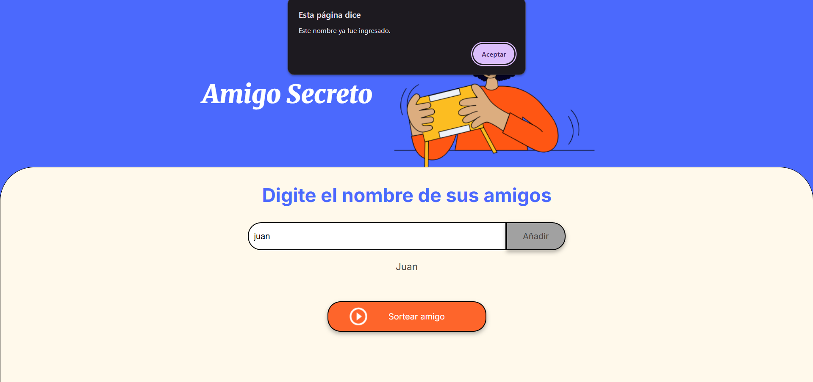
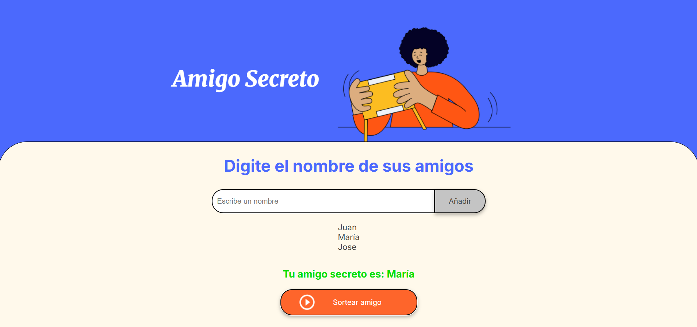

## **Amigo Secreto** 🎁

Este proyecto es una aplicación web que permite gestionar un sorteo de "Amigo Secreto". Los participantes pueden registrarse, y el sistema asignará aleatoriamente un amigo secreto.

### **Características**

- **Agregar participantes** asegurando nombres únicos y sin caracteres inválidos.
- **Realizar el sorteo** de manera aleatoria garantizando que nadie se asigne a sí mismo.
- **Mostrar el resultado** con el mensaje: _"Tu amigo secreto es: Nombre"_.

### 🛠️ **Tecnologías utilizadas**

- **HTML**, **CSS** y **JavaScript** para la interfaz y lógica del sorteo.

## 📷 Capturas de pantalla

Aquí se muestran algunas capturas del proyecto en funcionamiento:

